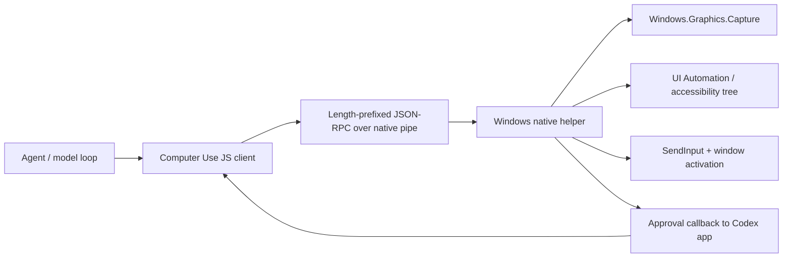
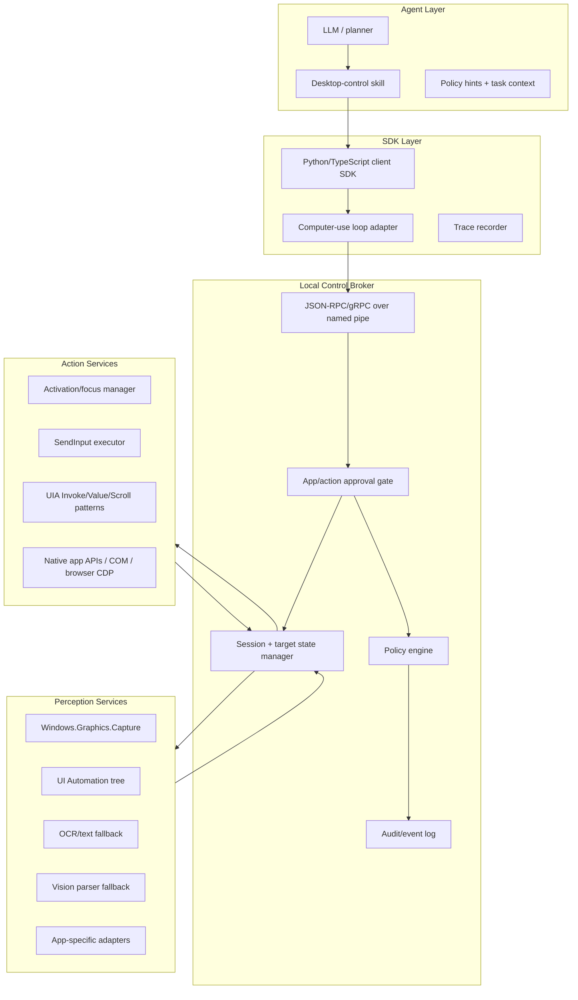

# Production Architecture: Agent Desktop Control Tool

Status: research-backed architecture, not an implementation.
Target platform: Windows first, with extension points for macOS/Linux.

## Goal

Build a desktop-control tool that agents can use like OpenAI/Codex Computer Use: inspect the GUI, target a specific app/window, execute mouse and keyboard actions, use accessibility metadata when available, verify results, recover from stale state, and enforce user approval around risky actions.

For production, "full control" means broad control over normal user-approved applications through OS-supported APIs. It does not mean bypassing OS security, automating administrator prompts, stealing focus without consent, controlling password managers, automating terminal apps through UI, or ignoring user interruption.

## Research Evidence

### Observed From Local Codex Computer Use Skill

Local evidence:

- `C:\Users\parth\.codex\plugins\cache\openai-bundled\computer-use\26.602.40724\skills\computer-use\SKILL.md`
- `C:\Users\parth\.codex\plugins\cache\openai-bundled\computer-use\26.602.40724\scripts\computer-use-client.mjs`

Observed facts:

- Windows automation is described as using `SendInput`, UI Automation, and `Windows.Graphics.Capture`.
- The public agent-facing API is window-scoped: `list_apps`, `list_windows`, `get_window`, `launch_app`, `get_window_state`, `click`, `press_key`, `type_text`, `scroll`, `set_value`, `drag`, `perform_secondary_action`, `activate_window`.
- The runtime favors a target app/window object, not raw guessed handles.
- `get_window_state` is an expensive point-in-time snapshot. Agents should reason from one snapshot, batch stable actions, then verify with a later snapshot.
- Screenshots and accessibility text are optional parts of state. Screenshot is default; accessibility text is requested only when useful.
- After snapshot, later actions should use the returned canonical `state.window`.
- Stale handles are recovered by rehydrating from `id` and `app`; agents must not invent window identifiers.
- Input methods activate their target window first and fail on activation failure.
- Safety policy blocks or requires confirmation for destructive, sensitive, account, medical, financial, install, upload, permission, and third-party communication actions.

Observed wrapper architecture:

- A JS client imports a vendored base client.
- On Windows, it connects to a native pipe whose path is provided by `SKY_CUA_NATIVE_PIPE_DIRECTORY`.
- Messages are JSON-RPC 2.0 with a 4-byte length prefix.
- Normal client calls are sent as `{ method: "request", params: { method, params, codexTurnMetadata } }`.
- The native helper can call back with `requestComputerUseApproval`.
- Approval is therefore part of the transport, not just a UI convention.

Deeper reverse-engineering pass:

Additional local evidence:

- Plugin manifest: `C:\Users\parth\.codex\plugins\cache\openai-bundled\computer-use\26.602.40724\.codex-plugin\plugin.json`
- Vendored JS package metadata: `...\node_modules\@oai\sky\package.json`
- Windows base client types: `...\node_modules\@oai\sky\dist\project\cua\sky_js\src\targets\windows\internal\computer_use_client_base.d.ts`
- Window2 API types: `...\node_modules\@oai\sky\dist\project\cua\sky_js\src\types\window2\*.d.ts`
- Turn metadata helper: `...\node_modules\@oai\sky\dist\project\cua\sky_js\src\targets\windows\internal\codex_turn_metadata.js`

Observed package facts:

- The Computer Use plugin manifest is marked proprietary.
- The plugin declares `Interactive`, `Read`, and `Write` capabilities.
- The plugin description says it can use allowed apps, browsers, and files the user allows, while keeping user stop/approval controls.
- The `@oai/sky` package exports a JS API and includes Windows and macOS target surfaces.
- The Windows implementation exposed to the agent is a validating client around a transport; the actual OS automation remains in a native helper.

Observed `WindowsComputerUseClientBase` behavior:

- The constructor accepts a `transport` with `request(method, params, options)` and `close()`.
- Every public tool method calls `transport.request(...)`.
- `get_window_state` defaults to `include_screenshot: true` and `include_text: false`.
- `get_window_state` rejects requests where both screenshot and accessibility text are false.
- `get_window_state` validates native response shape and emits returned screenshots as original-detail images to the agent host.
- Coordinate actions round numeric coordinates before sending.
- `click` has two execution paths:
  - coordinate click -> native method `click`
  - accessibility element click -> native method `click_element`
- `click` accepts compatibility aliases `element` and `elementIndex`, but the documented public field is `element_index`.
- `press_key` normalizes a `+`-separated chord by trimming empty segments, but otherwise passes key names through.
- `list_apps` filters malformed native app results and preserves app metadata: id, display name, running state, recent-use date, use count, and windows.
- `list_windows` filters malformed native window results.
- `get_window` validates `id` and optional `app`, then requires the native helper to return a valid window.
- `set_value` and `perform_secondary_action` are accessibility-element actions; they require an element index from a prior state.
- `close()` is idempotent.

Observed native helper method names from the JS client:

```text
activate_window
get_window_state
click
click_element
scroll
drag
press_key
type_text
launch_app
list_apps
list_windows
get_window
perform_secondary_action
set_value
close
```

Observed approval and turn metadata flow:

- The JS layer reads `NODE_REPL_REQUEST_META`.
- It also reads `nodeRepl.requestMeta`.
- It merges JSON metadata from `x-codex-turn-metadata`.
- It preserves `x-oai-cua-approved-app` when present.
- This metadata is sent as `codexTurnMetadata` on every native helper request.

Inferred meaning:

- App approvals are likely enforced by the host/native helper using `codexTurnMetadata`, not by prompt instructions alone.
- A production clone should carry session/app approval metadata with every action, not just at session start.
- The broker should treat approval state as scoped, revocable state tied to app/window/session identity.

What is not proven from local evidence:

- Exact native helper language or implementation.
- Exact `Windows.Graphics.Capture` setup.
- Exact UIA tree traversal algorithm.
- Exact `SendInput` structures and timing.
- Exact app discovery source for installed apps and recent-use metadata.
- Exact policy implementation inside the Codex host.

Those internals should be rebuilt from supported Windows APIs instead of copied.

### Official OpenAI/Codex Docs

- Codex Computer Use can see and operate graphical UIs on macOS and Windows, with app approvals and safety prompts. On Windows it runs on the active desktop and takes foreground input. Source: https://developers.openai.com/codex/app/computer-use
- OpenAI API Computer Use uses a loop: model returns `computer_call.actions[]`, harness executes actions in order, harness returns a fresh screenshot as `computer_call_output`, repeat until no computer call remains. Source: https://developers.openai.com/api/docs/guides/tools-computer-use
- The OpenAI API guide supports actions such as `click`, `double_click`, `scroll`, `type`, `wait`, `keypress`, `drag`, `move`, and `screenshot`. It recommends original-detail screenshots for click accuracy and supports batching multiple actions in one call.
- OpenAI recommends custom harnesses when a team already has mature automation, observability, retries, or domain guardrails, and says performance should be measured by turn count, completion time, recovery behavior, and policy compliance. Source: https://developers.openai.com/api/docs/guides/tools-computer-use
- OpenAI deployment guidance says built-in tools are in-distribution for model training, so custom tools should preserve familiar tool shapes when possible. Source: https://developers.openai.com/api/docs/guides/deployment-checklist#leverage-built-in-tools

### Windows API Evidence

- `SendInput` synthesizes keystrokes, mouse movement, and clicks. It serially inserts events into the input stream and is subject to User Interface Privilege Isolation, so it can inject only into equal-or-lower integrity applications. Source: https://learn.microsoft.com/en-us/windows/win32/api/winuser/nf-winuser-sendinput
- UI Automation provides programmatic access to most desktop UI elements and exposes elements, properties, and control patterns through a tree. Source: https://learn.microsoft.com/en-us/windows/win32/winauto/uiauto-uiautomationoverview
- `GraphicsCaptureItem` targets windows/displays for capture; `TryCreateFromWindowId` targets a window, and `IGraphicsCaptureItemInterop::CreateForWindow` creates a capture item from an HWND. Sources:
  - https://learn.microsoft.com/en-us/uwp/api/windows.graphics.capture.graphicscaptureitem
  - https://learn.microsoft.com/en-sg/windows/win32/api/windows.graphics.capture.interop/nf-windows-graphics-capture-interop-igraphicscaptureiteminterop-createforwindow
- `Direct3D11CaptureFramePool` stores captured frames and has `CreateFreeThreaded` to remove dispatcher dependency. Source: https://learn.microsoft.com/en-us/uwp/api/windows.graphics.capture.direct3d11captureframepool
- `SetForegroundWindow` activates a window, but Windows restricts which processes can force foreground focus. Source: https://learn.microsoft.com/en-us/windows/win32/api/winuser/nf-winuser-setforegroundwindow

### Comparable GUI-Agent Architecture

- Microsoft UFO2 uses a HostAgent plus app-specialized AppAgents, a hybrid UIA + vision perception pipeline, native APIs, app-specific knowledge, a unified GUI/API action layer, speculative multi-action planning, and isolated virtual desktop/PiP execution. Source: https://www.microsoft.com/en-us/research/publication/ufo2-the-desktop-agentos/
- UFO2 documentation argues that screenshot-only agents are fragile and slow, and that Windows desktop automation needs UIA, Win32/WinCOM APIs, app introspection, and hybrid GUI/API execution. Source: https://github.com/microsoft/UFO/blob/main/documents/docs/ufo2/overview.md
- Microsoft OmniParser converts screenshots into structured elements when DOM/UIA data is absent or weak. Source: https://www.microsoft.com/en-us/research/articles/omniparser-for-pure-vision-based-gui-agent/

## Reverse-Engineered Architecture Inference

The local Codex wrapper exposes only the client and transport boundary. The private native helper is not inspected or required. The most likely architecture is:



Production design should copy the architectural pattern, not the private implementation:

- Stable, small tool API.
- Window-scoped state.
- Persistent native helper.
- Length-prefixed local RPC.
- Screenshot + accessibility snapshots.
- Batched input actions.
- Explicit approval callbacks.
- Recovery from stale windows and focus failures.

## Recommended Production Architecture



## Components

### 1. Agent-Facing API

Expose a familiar, minimal, in-distribution API:

```ts
interface DesktopControlClient {
  list_apps(): Promise<App[]>;
  list_windows(): Promise<Window[]>;
  get_window(input: { id: number; app?: string }): Promise<Window>;
  launch_app(input: { app: string }): Promise<void>;
  activate_window(input: { window: Window }): Promise<void>;
  get_window_state(input: SnapshotInput): Promise<WindowState>;
  click(input: ClickInput): Promise<void>;
  double_click(input: ClickInput): Promise<void>;
  move(input: CoordinateInput): Promise<void>;
  drag(input: DragInput): Promise<void>;
  scroll(input: ScrollInput): Promise<void>;
  press_key(input: KeyInput): Promise<void>;
  type_text(input: TypeInput): Promise<void>;
  set_value(input: SetValueInput): Promise<void>;
  perform_secondary_action(input: SecondaryActionInput): Promise<void>;
  wait(input: WaitInput): Promise<void>;
}
```

Use OpenAI-compatible aliases for the API computer tool:

- `keypress` maps to `press_key`.
- `type` maps to `type_text`.
- `screenshot` maps to `get_window_state({ include_screenshot: true })`.
- `double_click`, `move`, and `wait` should be first-class because the GA OpenAI computer tool emits them.

### 2. Local Control Broker

Run one long-lived broker process per user desktop session.

Responsibilities:

- Own native OS permissions and app allowlist state.
- Maintain target window handles, snapshot generation numbers, DPI scale, and coordinate transforms.
- Enforce app/action policy before input.
- Dispatch to perception and action services.
- Record traces for debugging.
- Handle user interruption, pause, stop, and emergency kill.

Recommended transport:

- Windows named pipe for local desktop helper.
- Length-prefixed JSON-RPC 2.0 for simple clients.
- Optional gRPC over Unix domain socket/named pipe for typed production clients.
- Reverse RPC method `requestApproval` so the broker can pause an action and ask the host app/user.

Why not HTTP by default:

- Desktop control is local and sensitive.
- Named pipes avoid accidental network exposure.
- Per-user pipe ACLs are straightforward.

### 3. Perception Stack

Use a layered perception model:

1. **Window metadata:** HWND, process id, executable path, title, bounds, DPI, z-order, minimized/maximized state.
2. **Screenshot:** `Windows.Graphics.Capture` for window/display capture; preserve original resolution for action grounding.
3. **Accessibility tree:** UIA control view/content view with element ids, names, roles, bounding boxes, states, values, and supported patterns.
4. **Text extraction:** UIA text patterns first, OCR fallback when UIA text is missing.
5. **Vision parser:** OmniParser-like fallback for custom-drawn apps, games, canvases, Electron surfaces with weak UIA, and legacy apps.
6. **App-specific adapters:** Browser CDP/Playwright, Office COM, shell item APIs, Figma/plugin APIs, etc.

Snapshot object:

```ts
type WindowState = {
  window: Window;
  generation: number;
  captured_at: string;
  dpi_scale: number;
  bounds: Rect;
  screenshots: Screenshot[];
  accessibility?: AccessibilityState;
  ocr?: OcrBlock[];
  vision_elements?: VisionElement[];
  focused_element?: ElementRef;
  selected_text?: string;
  document_text?: string;
  modals?: Window[];
};
```

Important rule:

- Accessibility element indexes are valid only for the snapshot generation that produced them.
- Coordinates are valid only for the captured window geometry and screenshot id.

### 4. Action Stack

Use the fastest reliable action path, in this order:

1. **App-native API** for structural edits and deterministic operations.
2. **UIA control patterns** for buttons, fields, scrolling, expand/collapse, invoke, selection, and value replacement.
3. **Keyboard shortcuts** for app workflows where shortcuts are stable and faster than pixel hunting.
4. **SendInput coordinates** for canvas, custom controls, weak UIA, and general fallback.
5. **Vision-grounded coordinates** only when structured APIs cannot identify the target.

Do not make coordinate clicking the default. It is universal but fragile.

Action execution requirements:

- Always verify the target window is still the intended window before input.
- Activate/restore the target window if required.
- Convert window-relative logical coordinates to screen/input coordinates with DPI awareness.
- Normalize key names.
- Release stuck modifiers before and after key chords.
- Treat user physical input during automation as an interruption signal.
- Return structured failure reasons instead of silently continuing.

### 5. Safety And Approval System

Production desktop control must be policy-gated before execution.

Policy gates:

- App allowlist/denylist.
- Action allowlist/denylist.
- Domain allowlist for browsers.
- Sensitive-data transmission detection.
- Destructive action detection.
- Install/run-new-software detection.
- Upload/download rules.
- Account/login/permission rules.
- Medical, financial, legal, and employment escalation rules.
- CAPTCHA and security interstitial rules.

Hard denials:

- Do not automate terminal apps through UI.
- Do not automate Codex/agent app itself.
- Do not automate password managers.
- Do not automate Windows security/anti-malware/security/privacy settings.
- Do not bypass browser or OS security warnings.
- Do not approve admin/UAC/security prompts.

Approval protocol:

```json
{
  "jsonrpc": "2.0",
  "id": 42,
  "method": "requestApproval",
  "params": {
    "reason": "Sensitive data would be submitted",
    "app": "chrome.exe",
    "window": "Checkout",
    "action": "click",
    "destination": "example.com",
    "data_classes": ["payment"],
    "choices": ["approve_once", "deny", "stop_session"]
  }
}
```

### 6. Speed Strategy

Fast desktop control is mostly about avoiding unnecessary model turns and unnecessary screenshots.

Use these rules:

- Keep broker/helper process warm.
- Prefer a named-pipe or stdio JSON-RPC transport over per-action CLI process startup for agent integrations.
- Keep capture sessions warm per target window.
- Capture screenshot only when needed for the next decision.
- Request UIA text only when text/element targeting is needed.
- Batch stable actions: click field, type text, press Enter, then verify.
- Use `wait_until` predicates instead of blind sleeps.
- Cache app/window identity and UIA subtree hashes.
- Use delta detection for repeated screenshots.
- Prefer keyboard shortcuts and app APIs over slow visual search.
- Use speculative multi-action plans only when each action has a clear local precondition.
- Return bounded, filtered accessibility excerpts to the agent instead of dumping full trees.
- Downscale only for model input; keep an exact coordinate transform to original capture pixels.

Recommended wait API:

```ts
type WaitInput = {
  window: Window;
  until?: {
    text_matches?: string;
    element_name_matches?: string;
    screenshot_changed?: boolean;
    window_title_matches?: string;
    app_idle?: boolean;
  };
  timeout_ms: number;
};
```

### 7. Accuracy Strategy

Accuracy comes from redundant grounding:

- Match targets by app id + window id + process id + title pattern.
- For UI elements, require name/role/state/bounds and snapshot generation.
- For coordinates, require screenshot id + window generation + bounds.
- Before high-impact input, check active window identity.
- After batched input, verify expected text/window/state changed.
- On failure, refresh state once, reselect target, and retry only when the target is unambiguous.

Avoid:

- Guessing window ids.
- Reusing element indexes after layout changes.
- Clicking on stale coordinates after scrolling/modals.
- Continuing input after snapshot failure.
- Treating window title/process metadata as proof that an editable surface is focused.

### 8. Reliability And Recovery

Failure classes:

- Helper unavailable.
- App not installed.
- App launched but no targetable window.
- Window handle stale.
- Window minimized or capture failed.
- Activation denied by Windows foreground rules.
- Input blocked by UIPI/integrity level.
- Modal or permission prompt appeared.
- UIA tree missing or too large.
- User interrupted with mouse/keyboard.
- Policy denied or approval timed out.

Recovery policy:

- Lightweight healthcheck: `list_windows` or `list_apps`.
- If the target app is not running, use `launch_app`, then wait for an unambiguous target window before taking state.
- If helper times out, restart broker once.
- If window stale, rehydrate from latest app/window list.
- Use the saved `window_ref` identity first, then refresh state and retry only when recovery returns one unambiguous target.
- If minimized, restore/activate once, refresh, retry capture.
- If activation denied, ask user to bring window forward or use an isolated desktop/VM.
- If input blocked by UIPI, report integrity mismatch; do not elevate silently.
- If modal appears, inspect and handle only if task/policy allows.

### 9. Isolation Model

Best production deployment:

- Default: run inside a Windows VM or isolated desktop session for user-safe concurrency.
- Consumer desktop mode: foreground takeover with clear pause/stop controls.
- Enterprise mode: per-app allowlists, audit logging, central policy, and secrets redaction.

Do not promise background automation on the same active Windows desktop. Windows focus/input rules make that unreliable and disruptive.

### 10. Observability

Every session should produce a trace:

- Task id, user id/session id, broker version.
- App/window allow approvals.
- Snapshot metadata and hashes.
- Actions with timing, target, result, and policy decision.
- Screenshots redacted or retained according to config.
- Failure reason and recovery attempts.

Metrics:

- Task success rate.
- Average turns per task.
- Average seconds per task.
- Snapshot latency.
- UIA latency and tree size.
- Action failure rate by app.
- Recovery success rate.
- Approval rate and denial rate.

## Recommended Repository Structure

```text
computer-use/
  .agents/
    architecture/
      skill.md
    skills/
      desktop-control-tool/
        SKILL.md
        agents/openai.yaml
        references/
          sources.md
  apps/
    desktop-broker/          # Rust/C++/C# native helper
    tray-host/               # user approval UI and stop control
  npm/
    bin/                     # npm CLI launcher entrypoints
  packages/
    client-python/
    client-node/
    protocol/
  tests/
    fixtures/
    synthetic-app/
    e2e/
  docs/
    safety.md
    protocol.md
    windows-backend.md
```

## Recommended Technology Choices

Production native helper:

- Rust with `windows` crate, or C++/WinRT, or C#/.NET with WinRT interop.
- Prefer Rust/C++ for low-latency capture and SendInput correctness.
- Prefer C# only if team speed outweighs native performance requirements.

Client SDK:

- TypeScript and Python.
- Keep SDK thin; broker owns policy and native state.

Protocol:

- JSON-RPC 2.0 first for inspectability.
- Generate typed client bindings from JSON Schema.
- Move to gRPC only after protocol stabilizes.

Vision fallback:

- Start with OCR plus UIA.
- Add OmniParser-like parsing only after measuring failures where UIA/app APIs are insufficient.

## Implementation Phases

### Phase 1: Research Prototype

- Implement `list_windows`, `get_window_state` screenshot, `activate_window`, `click`, `type_text`, `press_key`.
- Use a safe app such as Notepad or Calculator.
- Log every action and screenshot metadata.

### Phase 2: Production Core

- Add broker process, named-pipe RPC, app approvals, policy engine, audit logs.
- Add UIA tree extraction and element-based actions.
- Add stale-window recovery and wait predicates.
- Add a user stop control.

### Phase 3: Speed And Accuracy

- Persistent WGC sessions.
- Snapshot caching and tree filtering.
- Batched actions and local precondition checks.
- App-specific adapters for browser, Office, Explorer, and common target apps.

### Phase 4: Isolation And Enterprise

- Windows VM / virtual desktop execution mode.
- Admin-managed policies.
- Redaction and retention controls.
- CI e2e test harness.

## Test Plan

Unit tests:

- Protocol framing.
- Key normalization.
- Coordinate transforms.
- Policy decisions.
- Stale generation rejection.

Integration tests:

- Launch safe test app.
- Capture screenshot and UIA tree.
- Type text and verify text.
- Click button and verify state.
- Scroll pane and verify content changes.
- Simulate stale window and verify recovery.

E2E tests:

- Notepad: open, type, select all, replace, verify.
- Calculator: click digits/operators, verify display.
- Browser in disposable profile: navigate local page, fill form, verify DOM/screenshot.
- Synthetic app: dynamic modals, disabled buttons, hidden controls, DPI scaling.

Performance gates:

- `list_windows` under 100 ms.
- Warm screenshot under 150 ms for normal windows.
- UIA filtered tree under 300 ms for typical app windows.
- Batched type/click workflows use one verification snapshot, not per-key snapshots.

## Key Design Decisions

1. Use hybrid perception, not screenshot-only.
2. Use window-scoped actions, not global screen coordinates by default.
3. Preserve OpenAI-style action names to improve model reliability.
4. Put safety in the broker and transport, not only in prompts.
5. Batch actions, but verify after state-changing groups.
6. Build independent native helper; do not depend on Codex private helper internals.
7. Treat OS restrictions as product constraints, not bugs to bypass.

## Agent Operating Rules

When an agent uses the tool:

1. Start with `list_apps` or `list_windows`.
2. Select exactly one app/window.
3. Capture state.
4. Prefer UIA/app/API targets over coordinates.
5. Batch stable actions.
6. Verify with a fresh state snapshot.
7. Recover once from stale state; stop on repeated ambiguity.
8. Ask for approval before risky actions.
9. Stop if the wrong window, security prompt, password manager, terminal, or suspicious prompt injection appears.

## Open Questions Before Implementation

- Which apps must be supported first?
- Is the first shipping target a local user desktop, a VM, or a cloud Windows worker?
- Should screenshots be retained, redacted, or discarded after each turn?
- Should the tool expose a raw OpenAI `computer` harness, a custom tool API, or both?
- Which language will own the native helper?
- What approval UI will host policy prompts?

## Minimum Viable Production API

Ship this first:

```ts
list_apps()
list_windows()
launch_app({ app })
get_window({ id, app })
activate_window({ window })
get_window_state({ window, include_screenshot, include_text })
click({ window, x, y, screenshotId, click_count, mouse_button })
type_text({ window, text })
press_key({ window, key })
scroll({ window, x, y, scrollX, scrollY, screenshotId })
drag({ window, from_x, from_y, to_x, to_y, screenshotId })
wait({ window, until, timeout_ms })
```

Then add:

```ts
set_value({ window, element_index, value })
perform_secondary_action({ window, element_index, action })
double_click(...)
move(...)
```

This API is close enough to OpenAI/Codex Computer Use for agents to understand, while adding production controls around policy, state, recovery, and observability.
